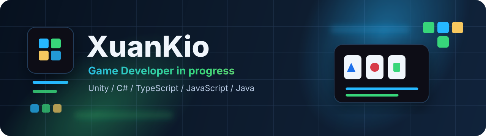

<div align="center">
  

  <br />
  <br />

  <a href="https://github.com/XuanKio">
    
  </a>
  
  
</div>

---

## Player profile

<table>
  <tr>
    <td width="58%">
      <h3>About</h3>
      <p>
        I am <strong>Hoang Xuan Cuong</strong>, a developer from Vietnam learning game development by building playable projects, breaking problems down, and improving each version after it works.
      </p>
      <p>
        My current direction is gameplay programming, Unity/C# practice, browser-based mini games, and stronger software engineering fundamentals.
      </p>
    </td>
    <td width="42%">
      <h3>Current build</h3>
      <pre><code>Role        Game developer in progress
Main stack  Unity / C# / TypeScript
Side stack  JavaScript / Java
Loop        Build -> test -> improve
Location    Vietnam</code></pre>
    </td>
  </tr>
</table>

## Loadout

<div align="center">


</div>

## Featured builds

| Project | Stack | Highlight |
| --- | --- | --- |
| [CoWord-Cafe](https://github.com/XuanKio/CoWord-Cafe) | JavaScript | Web project practice with frontend flow and interaction logic. |
| [GameJam](https://github.com/XuanKio/GameJam) | C# | Rapid game prototyping and gameplay implementation. |
| [Tetris-Learn-3](https://github.com/XuanKio/Tetris-Learn-3) | TypeScript | Grid logic, state handling, and browser game interaction. |
| [BlackJackFFLite-Learn-2](https://github.com/XuanKio/BlackJackFFLite-Learn-2) | C# | Card game rules, turn flow, and Unity/C# practice. |
| [FlappyBird-ProjectLearn-1](https://github.com/XuanKio/FlappyBird-ProjectLearn-1) | C# | Arcade movement, collision, scoring, and gameplay loop. |
| [Draw-To-Save](https://github.com/XuanKio/Draw-To-Save) | TypeScript | Drawing-based prototype mechanics and interactive logic. |
| [CNPM](https://github.com/XuanKio/CNPM) | Java | Software engineering coursework and Java fundamentals. |

## Contribution snake

<div align="center">
  <picture>
    <source
      media="(prefers-color-scheme: dark)"
      srcset="https://raw.githubusercontent.com/XuanKio/XuanKio/output/github-contribution-grid-snake-dark.svg"
    />
    
  </picture>
</div>

## Progress map

```txt
Gameplay systems       In progress
Unity architecture     In progress
Browser mini games     In progress
Java fundamentals      Practicing
Project polish         Leveling up
```

---

<div align="center">
  <strong>Building one project at a time.</strong>
  <br />
  <sub>Thanks for visiting my profile.</sub>
</div>
