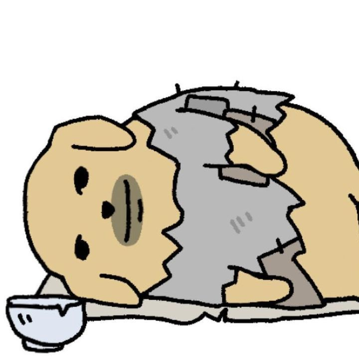
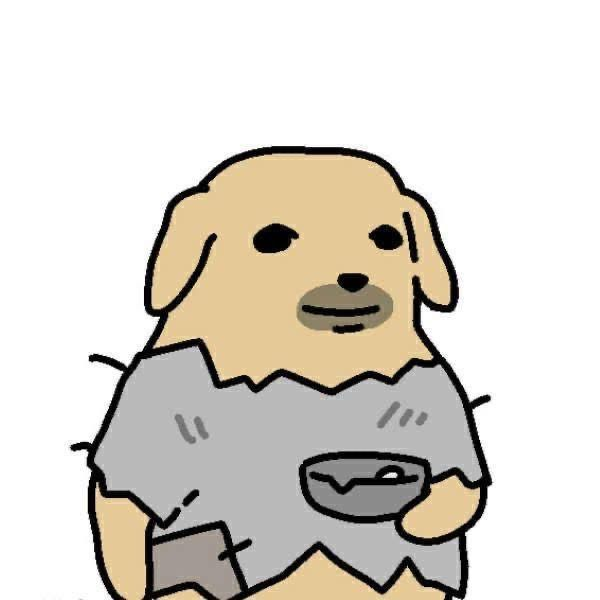
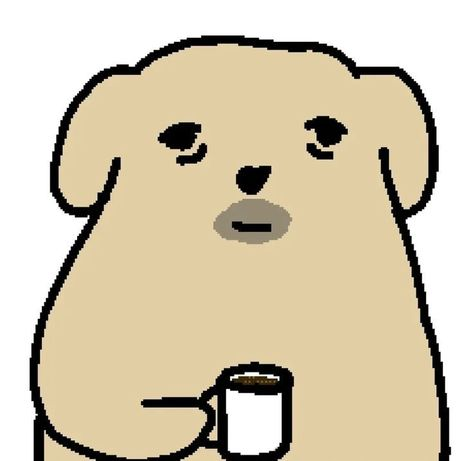

<div align="center">
  
  
  

  <h1>XuanKio</h1>
  <h3>Unity / Cocos Game Developer in progress</h3>

  <a href="https://github.com/XuanKio">
    
  </a>
  
  
</div>

---

## Player profile

<table>
  <tr>
    <td width="58%">
      <h3>About</h3>
      <p>
        I am <strong>Hoang Xuan Cuong</strong>, a developer from Vietnam learning game development by rebuilding familiar game mechanics, shipping small projects, and improving each version.
      </p>
      <p>
        My current focus is <strong>Unity</strong>, <strong>Cocos</strong>, gameplay systems, clean project structure, and practical game programming.
      </p>
    </td>
    <td width="42%">
      <h3>Current build</h3>
      <pre><code>Role        Game developer in progress
Engines     Unity / Cocos
Scripting   C# / TypeScript
Practice    Remake -> playtest -> polish
Location    Vietnam</code></pre>
    </td>
  </tr>
</table>

## Loadout

<div align="center">


</div>

## Unity/Cocos Cover Shelf

Public learning remakes that people can reference for mechanics, structure, and implementation ideas.

<table>
  <tr>
    <td width="33%">
      <h3><a href="https://github.com/XuanKio/Tetris-Learn-3">Tetris Learn 3</a></h3>
      <p><strong>Cocos / TypeScript</strong></p>
      <p>Grid logic, falling blocks, line clears, state handling, and browser game interaction.</p>
    </td>
    <td width="33%">
      <h3><a href="https://github.com/XuanKio/BlackJackFFLite-Learn-2">BlackJack FFLite Learn 2</a></h3>
      <p><strong>Unity / C#</strong></p>
      <p>Card game rules, turn flow, UI states, and basic gameplay loop practice.</p>
    </td>
    <td width="33%">
      <h3><a href="https://github.com/XuanKio/FlappyBird-ProjectLearn-1">FlappyBird Project Learn 1</a></h3>
      <p><strong>Unity / C#</strong></p>
      <p>Arcade movement, collision, scoring, obstacle spawning, and replay flow.</p>
    </td>
  </tr>
</table>

## Other public builds

| Project | Stack | Highlight |
| --- | --- | --- |
| [CoWord-Cafe](https://github.com/XuanKio/CoWord-Cafe) | JavaScript | Web project practice with frontend flow and interaction logic. |
| [GameJam](https://github.com/XuanKio/GameJam) | Unity / C# | Rapid game prototyping and gameplay implementation. |
| [Draw-To-Save](https://github.com/XuanKio/Draw-To-Save) | Cocos / TypeScript | Drawing-based prototype mechanics and interactive logic. |
| [CNPM](https://github.com/XuanKio/CNPM) | Java | Software engineering coursework and Java fundamentals. |

## Contribution snake

<div align="center">
  <picture>
    <source
      media="(prefers-color-scheme: dark)"
      srcset="https://raw.githubusercontent.com/XuanKio/XuanKio/output/github-contribution-grid-snake-dark.svg"
    />
    
  </picture>
</div>

## Progress map

```txt
Unity gameplay         In progress
Cocos projects         In progress
Game remakes           Building references
Project structure      Leveling up
Gameplay polish        Practicing
```

---

<div align="center">
  <strong>Building playable references, one project at a time.</strong>
  <br />
  <sub>Thanks for visiting my profile.</sub>
</div>
